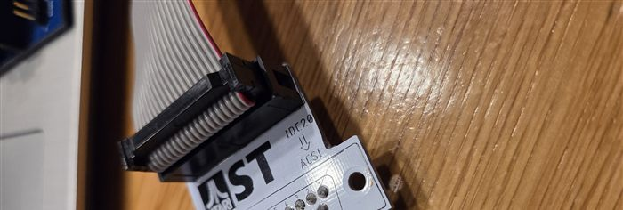

# ACSI2TNFS hardware

Two boards with the same circuit, so one firmware fits both. Only the connection to the
Atari's ACSI port differs:

| | `v2` | `v2-cable` |
|---|---|---|
| Connection | the board plugs straight into the ACSI port | a 20-wire flat cable to a Lotharek DB19 adapter in the ACSI port |
| Extra parts | 19 special pins for the DB19 | the Lotharek adapter and a flat cable |
| Pass-through | no | yes: a second header for another ACSI device |

> **Firmware:** the current firmware still uses the pin map of the earlier development
> board. A board setting for `v2` / `v2-cable` (different GPIOs, see the pin map below)
> is still to come.

## v2: straight into the ACSI port

The DB19 is part of the board: 19 loose pins soldered into the board take the place of
a DB19 plug (footprint `ACSI_DB19_Male_WAGO_243-131`). The board sits on the back of the
Atari without a cable.

- **Pro:** no adapter and no cable needed.
- **Con:** you need the special pins, e.g. from RS:
  <https://nl.rs-online.com/web/p/terminal-block-accessories/2885173>

## v2-cable: with a Lotharek adapter

The board lies loose behind the Atari and hangs on a Lotharek DB19 adapter through a
20-wire flat cable. That adapter comes with Lotharek's
[UltraSatan](https://lotharek.pl/products.php?id=15): if you already have one, this is the
easiest way.

- **J1 "To ACSI"** takes the cable from the adapter. **J2 "ACSI pass-through"** carries
  the same signals on, e.g. to the UltraSatan, which then shares the bus with its own
  ACSI id.
- J1 and J2 are keyed box headers. Their pins are numbered **per row**: 1-10 along the
  row on the side of the key, 11-20 along the other row (footprint
  `IDC-Header_2x10_P2.54mm_Vertical_NR_PER_ROW`).
- So **pin n on the board is ACSI pin n**, because the adapter puts DB19 pins 1-10 on one
  row of its header and 11-19 on the other. This is **not** the usual IDC numbering
  (1 and 2 opposite each other): a standard 2x10 footprint would mix up the signals.
- The cable is a straight 20-wire flat cable with an IDC socket at each end, keyed the
  same way at both ends.

| Pin | Signal | Pin | Signal |
|---|---|---|---|
| 1-8 | DATA0-DATA7 | 11, 13, 15, 17 | GND |
| 9 | /CS | 12 | /RESET |
| 10 | /IRQ | 14 | /ACK |
| | | 16 | A1 |
| | | 18 | R/W |
| | | 19 | /DRQ |
| | | 20 | not used |

## Both boards

- **Raspberry Pi Pico 2 W** on pin headers. The Pico powers the
  board from USB; the ACSI port has no supply pin.
- **U1** 74LVC245: data bus D0-D7, direction (DIR) and enable (/OE) from the Pico.
  **U2** 74LVC245: /CS, /RESET, /ACK, A1 and R/W to the Pico, fixed direction.
  **U3** 74LS07: /IRQ and /DRQ as open-collector outputs.
- **SW1:** button (hidden mode on/off). **J3:** optional micro SD card (3.3 V module).
- **Leds:** D1/D2 are 0805 SMD. `v2-cable` also has D3/D4, the same leds as 3 mm
  through-hole parts on the same resistor: fit **either** D1 **or** D3 (and D2 or D4),
  not both.

### Design rules learnt the hard way

The Atari's floppy controller shares the ACSI data bus and the /IRQ line, so the board
must keep off them when it is not talking:

- **No pull-ups on /IRQ and /DRQ** to the board's own supply: without USB that supply is
  0 V and the resistors pull the lines low, which upsets the floppy drive. The Atari has
  its own pull-ups.
- **10k pull-up on /OE of U1** (R5): the data bus buffer stays off while the Pico is not
  running (power-up, reset, BOOTSEL).
- **10k pull-ups on the 74LS07 inputs** (R6, R7): a Pico in reset pulls its pins low,
  which would otherwise assert /IRQ and /DRQ.

### Pin map (v2 and v2-cable)

| Pico | Signal | Pico | Signal |
|---|---|---|---|
| GP0 | power led | GP16 | /CS |
| GP2-GP5 | SD card: CLK, MOSI, MISO, CS | GP17 | /RESET |
| GP6-GP13 | DATA7 ... DATA0 (reversed order) | GP18 | /ACK |
| GP14 | DIR of U1 | GP19 | A1 |
| GP15 | /OE of U1 | GP20 | R/W |
| GP26 | button | GP21 | /IRQ (via U3, low = active) |
| GP28 | status led | GP22 | /DRQ (via U3, low = active) |

## Files

Each folder is a KiCad 9 project with `schema.pdf`. The project's own footprints are in
`footprints.pretty`; `fp-lib-table` points KiCad to it, so keep it with the project.
There are no Gerber files yet: make them in KiCad (*File > Fabrication Outputs*) from
the version you want to order.
